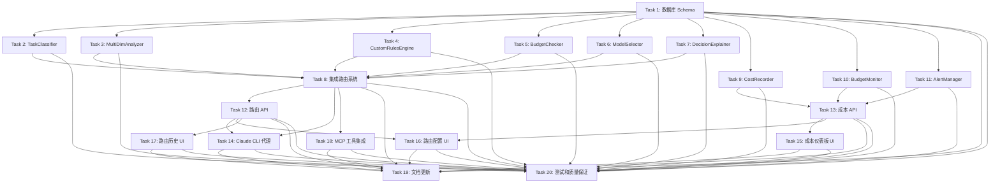

# Implementation Plan

## Overview

本实施计划定义了 APOS Claude 模型路由规则优化功能的开发任务。该功能将增强现有的模型路由系统，实现多维度智能路由决策、完善的 Claude 集成（Extended Thinking 和 Prompt Caching）、实时成本追踪、成本预警系统以及统一的配置管理界面。

总共包含 20 个主要任务，147 个子任务，预计开发时间约 158 小时（单人开发约 4 周）。

## Tasks

- [x] 1. 数据库 Schema 和迁移 - 创建新的数据库表和迁移脚本
  - [x] 1.1. 创建 routing_decisions 表迁移
  - [x] 1.2. 创建 cost_records 表迁移
  - [x] 1.3. 创建 custom_rules 表迁移
  - [x] 1.4. 创建 budget_alerts 表迁移
  - [x] 1.5. 扩展 settings 表（添加新配置项）
  - [x] 1.6. 创建数据库索引
  - [x] 1.7. 编写配置迁移脚本
  - [x] 1.8. 测试迁移脚本
  
  **Acceptance Criteria**: 所有表创建成功；索引创建成功；迁移脚本可重复执行；向后兼容现有数据
  
  **Estimated Time**: 4 hours

- [x] 2. TaskClassifier 实现 - 实现任务类型分类器
  - [x] 2.1. 创建 TaskClassifier 类
  - [x] 2.2. 实现关键词匹配逻辑
  - [x] 2.3. 实现模式识别（代码块、问题标记）
  - [x] 2.4. 添加置信度计算
  - [x] 2.5. 编写单元测试
  - [x] 2.6. 性能优化（< 10ms）
  
  **Acceptance Criteria**: 准确分类 7 种任务类型；置信度 > 0.8；执行时间 < 10ms；测试覆盖率 > 90%
  
  **Estimated Time**: 6 hours

- [x] 3. MultiDimAnalyzer 实现 - 实现多维度分析器
  - [x] 3.1. 创建 MultiDimAnalyzer 类
  - [x] 3.2. 实现上下文大小计算
  - [x] 3.3. 实现代码复杂度计算
  - [x] 3.4. 实现成本估算
  - [x] 3.5. 实现 Extended Thinking 判断逻辑
  - [x] 3.6. 编写单元测试
  - [x] 3.7. 性能优化
  
  **Acceptance Criteria**: 准确计算上下文大小（token 数量）；代码复杂度评分 0-100；成本估算误差 < 10%；测试覆盖率 > 85%
  
  **Estimated Time**: 8 hours

- [x] 4. CustomRulesEngine 实现 - 实现自定义规则引擎
  - [x] 4.1. 创建 CustomRulesEngine 类
  - [x] 4.2. 实现规则加载和缓存
  - [x] 4.3. 实现规则匹配算法
  - [x] 4.4. 实现规则 CRUD 操作
  - [x] 4.5. 实现规则优先级排序
  - [x] 4.6. 编写单元测试
  - [x] 4.7. 编写集成测试
  
  **Acceptance Criteria**: 支持多条件规则匹配；按优先级正确排序；规则缓存有效（TTL 5分钟）；测试覆盖率 > 85%
  
  **Estimated Time**: 10 hours

- [x] 5. BudgetChecker 实现 - 实现预算检查器
  - [x] 5.1. 创建 BudgetChecker 类
  - [x] 5.2. 实现当前支出查询
  - [x] 5.3. 实现预算限制查询
  - [x] 5.4. 实现预算状态检查
  - [x] 5.5. 实现替代模型建议
  - [x] 5.6. 编写单元测试
  - [x] 5.7. 性能优化（查询缓存）
  
  **Acceptance Criteria**: 准确计算当前支出；正确判断预算状态；合理建议替代模型；查询时间 < 50ms
  
  **Estimated Time**: 6 hours

- [x] 6. ModelSelector 增强 - 增强模型选择器，支持 Extended Thinking 和 Prompt Caching
  - [x] 6.1. 扩展 ModelSelector 类
  - [x] 6.2. 添加 Extended Thinking 支持
  - [x] 6.3. 添加 Prompt Caching 判断逻辑
  - [x] 6.4. 更新 Claude 模型选择逻辑
  - [x] 6.5. 集成 BudgetChecker
  - [x] 6.6. 编写单元测试
  - [x] 6.7. 编写集成测试
  
  **Acceptance Criteria**: 支持 claude-3-7-sonnet (Extended Thinking)；正确应用 Prompt Caching 标记；考虑预算限制选择模型；测试覆盖率 > 85%
  
  **Estimated Time**: 8 hours

- [x] 7. DecisionExplainer 实现 - 实现路由决策解释器
  - [x] 7.1. 创建 DecisionExplainer 类
  - [x] 7.2. 实现决策摘要生成
  - [x] 7.3. 实现详细解释生成
  - [x] 7.4. 添加预算影响说明
  - [x] 7.5. 添加自定义规则标注
  - [x] 7.6. 编写单元测试
  
  **Acceptance Criteria**: 生成清晰的决策摘要；包含所有关键信息；易于理解的格式；测试覆盖率 > 80%
  
  **Estimated Time**: 4 hours

- [x] 8. 集成路由系统 - 将所有组件集成到统一的路由系统
  - [x] 8.1. 创建 EnhancedRoutingSystem 类
  - [x] 8.2. 集成所有子组件
  - [x] 8.3. 实现完整的路由流程
  - [x] 8.4. 添加错误处理
  - [x] 8.5. 添加性能监控
  - [x] 8.6. 编写集成测试
  - [x] 8.7. 性能测试（< 100ms）
  
  **Acceptance Criteria**: 完整的路由决策流程；路由决策时间 < 100ms (P95)；错误处理完善；测试覆盖率 > 85%
  
  **Estimated Time**: 10 hours
  
  **Dependencies**: 2, 3, 4, 5, 6, 7

- [x] 9. CostRecorder 实现 - 实现成本记录器
  - [x] 9.1. 创建 CostRecorder 类
  - [x] 9.2. 实现成本计算逻辑
  - [x] 9.3. 添加模型定价表
  - [x] 9.4. 实现异步批量记录
  - [x] 9.5. 添加缓存节省计算
  - [x] 9.6. 编写单元测试
  - [x] 9.7. 性能优化
  
  **Acceptance Criteria**: 准确计算各模型成本；支持 Prompt Caching 成本计算；异步记录不阻塞主流程；测试覆盖率 > 85%
  
  **Estimated Time**: 6 hours

- [x] 10. BudgetMonitor 实现 - 实现预算监控器
  - [x] 10.1. 创建 BudgetMonitor 类
  - [x] 10.2. 实现预算检查逻辑
  - [x] 10.3. 实现预警生成
  - [x] 10.4. 实现自动降级逻辑
  - [x] 10.5. 添加预警确认功能
  - [x] 10.6. 编写单元测试
  - [x] 10.7. 编写集成测试
  
  **Acceptance Criteria**: 准确检测预算使用情况；在阈值触发预警；自动降级功能正常；测试覆盖率 > 85%
  
  **Estimated Time**: 8 hours

- [x] 11. AlertManager 实现 - 实现预警管理器
  - [x] 11.1. 创建 AlertManager 类
  - [x] 11.2. 实现 UI 通知
  - [x] 11.3. 实现邮件通知（可选）
  - [x] 11.4. 实现 Webhook 通知（可选）
  - [x] 11.5. 添加通知配置管理
  - [x] 11.6. 编写单元测试
  
  **Acceptance Criteria**: UI 通知正常显示；支持多种通知方式；通知配置可管理；测试覆盖率 > 80%
  
  **Estimated Time**: 6 hours

- [x] 12. 路由 API 实现 - 实现路由相关的 API 端点
  - [x] 12.1. 实现 POST /api/routing/route
  - [x] 12.2. 实现 GET /api/routing/history
  - [x] 12.3. 实现 GET /api/routing/rules
  - [x] 12.4. 实现 POST /api/routing/rules
  - [x] 12.5. 实现 PUT /api/routing/rules/:id
  - [x] 12.6. 实现 DELETE /api/routing/rules/:id
  - [x] 12.7. 实现 PATCH /api/routing/rules/:id/toggle
  - [x] 12.8. 添加 API 文档
  - [x] 12.9. 编写 API 测试
  
  **Acceptance Criteria**: 所有端点正常工作；请求验证完善；错误处理完善；API 文档完整
  
  **Estimated Time**: 10 hours
  
  **Dependencies**: 8

- [x] 13. 成本 API 实现 - 实现成本相关的 API 端点
  - [x] 13.1. 实现 GET /api/costs/summary
  - [x] 13.2. 实现 GET /api/costs/budget
  - [x] 13.3. 实现 POST /api/costs/budget
  - [x] 13.4. 实现 GET /api/costs/alerts
  - [x] 13.5. 实现 POST /api/costs/alerts/:id/acknowledge
  - [x] 13.6. 优化查询性能
  - [x] 13.7. 添加 API 文档
  - [x] 13.8. 编写 API 测试
  
  **Acceptance Criteria**: 所有端点正常工作；查询时间 < 200ms；数据准确性 100%；API 文档完整
  
  **Estimated Time**: 8 hours
  
  **Dependencies**: 9, 10, 11

- [x] 14. Claude CLI 代理增强 - 增强 Claude CLI 代理功能
  - [x] 14.1. 集成 EnhancedRoutingSystem
  - [x] 14.2. 添加任务分类
  - [x] 14.3. 应用 Prompt Caching
  - [x] 14.4. 添加成本记录
  - [x] 14.5. 添加响应头（路由信息）
  - [x] 14.6. 支持流式响应
  - [x] 14.7. 编写端到端测试
  
  **Acceptance Criteria**: 自动路由到最优模型；Prompt Caching 正常工作；成本正确记录；响应头包含路由信息
  
  **Estimated Time**: 8 hours
  
  **Dependencies**: 8, 12

- [x] 15. 成本仪表板 UI - 创建成本仪表板页面
  - [x] 15.1. 创建 /costs 页面
  - [x] 15.2. 实现 CostOverview 组件
  - [x] 15.3. 实现 ProviderBreakdown 组件（饼图）
  - [x] 15.4. 实现 TaskTypeBreakdown 组件（柱状图）
  - [x] 15.5. 实现 TrendChart 组件（折线图）
  - [x] 15.6. 实现 BudgetProgress 组件
  - [x] 15.7. 实现 OptimizationSuggestions 组件
  - [x] 15.8. 添加导出功能（CSV/PDF）
  - [x] 15.9. 响应式设计
  - [x] 15.10. 编写组件测试
  
  **Acceptance Criteria**: 所有图表正常显示；数据实时更新；导出功能正常；移动端适配良好
  
  **Estimated Time**: 12 hours
  
  **Dependencies**: 13

- [x] 16. 路由配置 UI - 创建路由配置页面
  - [x] 16.1. 创建 /settings/routing 页面
  - [x] 16.2. 实现通用设置部分
  - [x] 16.3. 实现任务类型映射部分
  - [x] 16.4. 实现预算管理部分
  - [x] 16.5. 实现自定义规则管理部分
  - [x] 16.6. 添加规则创建/编辑对话框
  - [x] 16.7. 添加配置导入/导出功能
  - [x] 16.8. 添加配置验证
  - [x] 16.9. 编写组件测试
  
  **Acceptance Criteria**: 所有配置项可编辑；配置验证正常；保存功能正常；导入/导出功能正常
  
  **Estimated Time**: 10 hours
  
  **Dependencies**: 12, 13

- [x] 17. 路由历史 UI - 创建路由历史页面
  - [x] 17.1. 创建 /routing/history 页面
  - [x] 17.2. 实现历史记录列表
  - [x] 17.3. 实现过滤功能
  - [x] 17.4. 实现详情查看
  - [x] 17.5. 实现性能统计显示
  - [x] 17.6. 添加导出功能
  - [x] 17.7. 添加分页功能
  - [x] 17.8. 编写组件测试
  
  **Acceptance Criteria**: 历史记录正确显示；过滤功能正常；性能统计准确；分页功能正常
  
  **Estimated Time**: 8 hours
  
  **Dependencies**: 12

- [x] 18. MCP 工具集成 - 将路由系统集成到 MCP 工具
  - [x] 18.1. 更新 MCP Server 代码
  - [x] 18.2. 为每个工具添加路由
  - [x] 18.3. 添加成本记录
  - [x] 18.4. 在工具响应中包含成本信息
  - [x] 18.5. 编写端到端测试
  
  **Acceptance Criteria**: 所有 MCP 工具使用路由系统；成本正确记录；工具响应包含成本信息；测试覆盖率 > 80%
  
  **Estimated Time**: 6 hours
  
  **Dependencies**: 8

- [x] 19. 文档更新 - 更新项目文档
  - [x] 19.1. 更新 README.md
  - [x] 19.2. 更新 ARCHITECTURE.md
  - [x] 19.3. 创建路由系统文档
  - [x] 19.4. 创建成本优化指南
  - [x] 19.5. 更新 API 文档
  - [x] 19.6. 创建迁移指南
  - [x] 19.7. 创建故障排查指南
  - [x] 19.8. 添加示例和截图
  
  **Acceptance Criteria**: 所有文档与实现一致；文档清晰易懂；包含完整示例；包含故障排查信息
  
  **Estimated Time**: 8 hours

- [x] 20. 测试和质量保证 - 完善测试覆盖和质量保证
  - [x] 20.1. 补充单元测试（目标 >80% 覆盖率）
  - [x] 20.2. 补充集成测试
  - [x] 20.3. 编写端到端测试
  - [x] 20.4. 性能测试
  - [x] 20.5. 成本计算准确性测试
  - [x] 20.6. 向后兼容性测试
  - [x] 20.7. 错误处理测试
  - [x] 20.8. 修复发现的 bug
  
  **Acceptance Criteria**: 代码覆盖率 > 80%；所有测试通过；性能指标达标；无已知 bug
  
  **Estimated Time**: 12 hours

## Notes

### 开发顺序建议

1. **第一阶段（基础设施）**: Task 1 - 数据库 Schema 和迁移
2. **第二阶段（核心组件）**: Task 2-7 可以并行开发
3. **第三阶段（系统集成）**: Task 8 - 集成路由系统
4. **第四阶段（成本系统）**: Task 9-11 可以并行开发
5. **第五阶段（API 层）**: Task 12-13
6. **第六阶段（应用集成）**: Task 14, 18
7. **第七阶段（UI 界面）**: Task 15-17
8. **第八阶段（文档和测试）**: Task 19-20

### 关键技术点

- **性能要求**: 路由决策 < 100ms，成本查询 < 200ms
- **测试覆盖率**: 目标 > 80%
- **向后兼容**: 必须保持与现有系统的兼容性
- **异步处理**: 成本记录使用异步批量处理，不阻塞主流程
- **缓存策略**: 配置和规则使用内存缓存，TTL 5分钟

### 风险和注意事项

1. **数据库迁移**: 需要仔细测试，确保不影响现有数据
2. **性能优化**: 路由决策必须快速，需要使用缓存和索引
3. **成本计算准确性**: 定价表需要及时更新，计算逻辑需要严格测试
4. **Extended Thinking**: 新功能，需要充分测试和文档说明
5. **Prompt Caching**: 需要正确实现缓存标记和成本计算

## Task Dependency Graph

